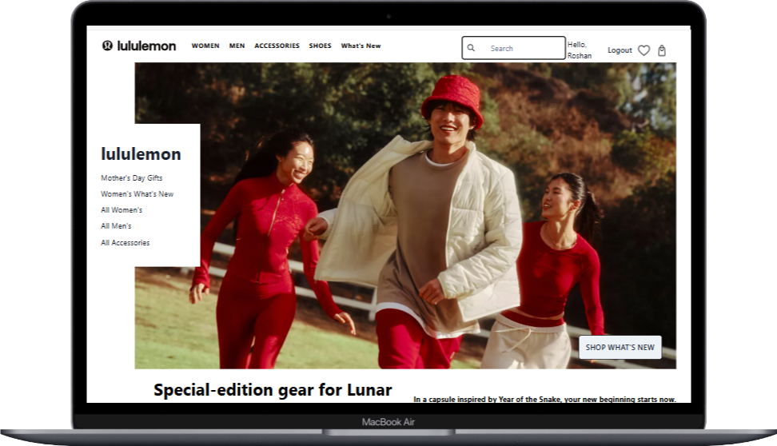
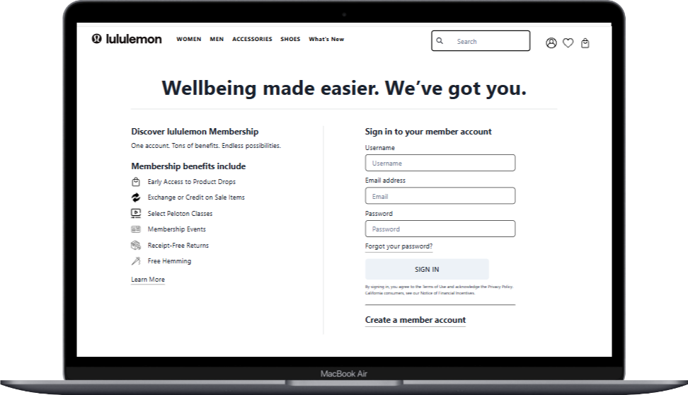
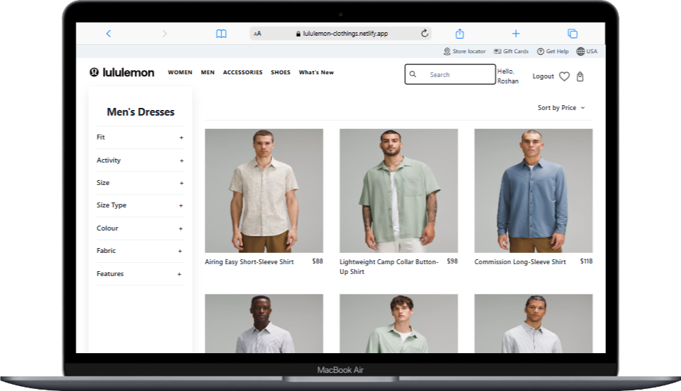
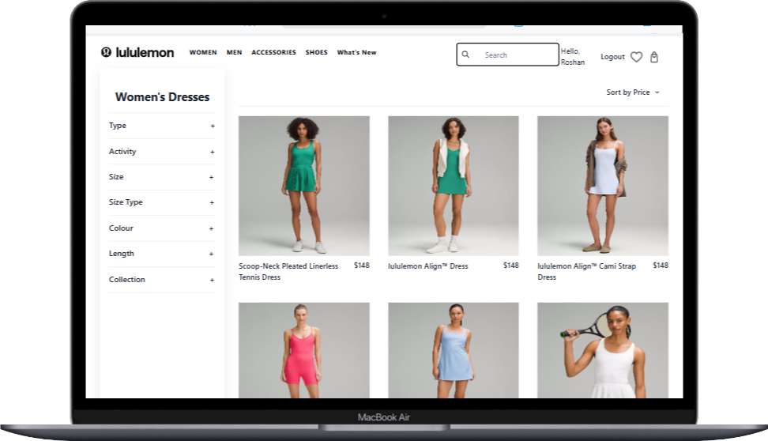
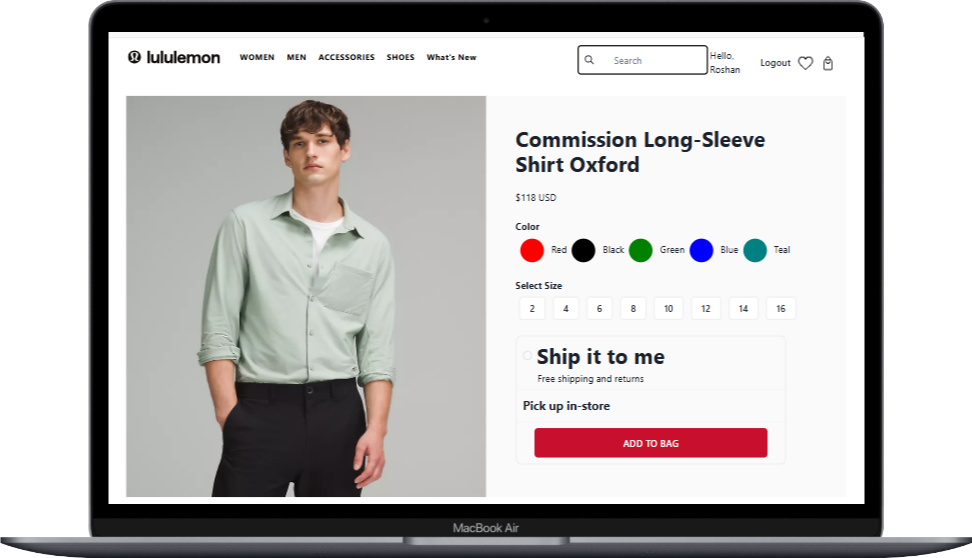
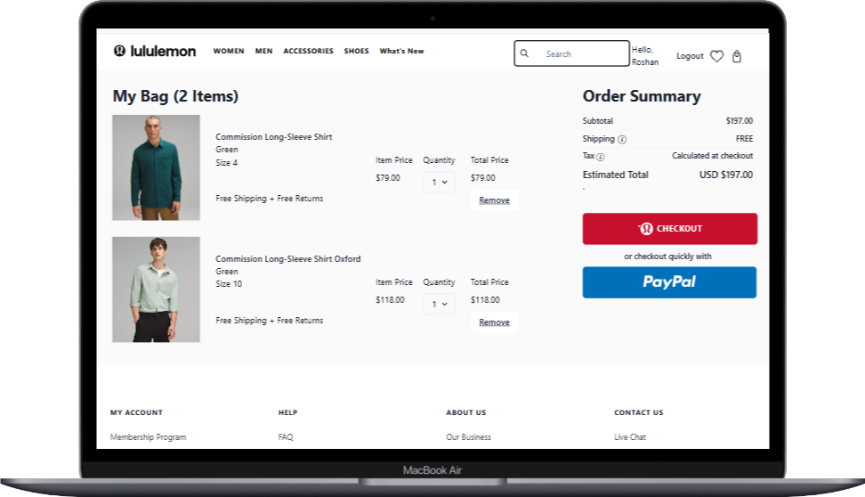
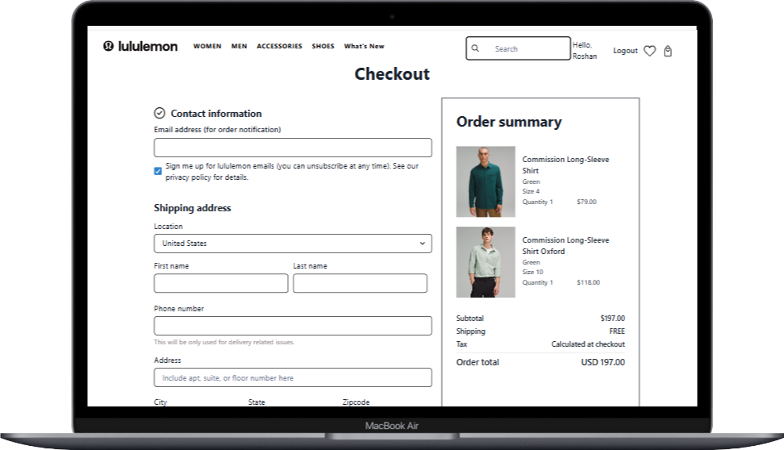

# Lululemon Clone website

### Welcome to my cool website that resembles Lululemon, featuring various real-life features, built with React and Chakra UI.
## Link **[https://lululemon-clothings.netlify.app/](https://lululemon-clothings.netlify.app/)**

## Dependencies
- react: 18.2.0
- react-dom: 18.2.0
- framer-motion
- chakra ui
- react-icons: 5.0.1,
- react-router-dom: 6.22.2

#### User Authentication

- <mark>Register</mark> , <mark>Login</mark> and <mark>Logout</mark> feature
   using local storage

#### Main Landing Page

* Page where you show the main most trending and popular products

#### Dynamic Links (with the help of router)

- For every page like: SignUp, Login, Landing page are using Dynamic links when ever user clicks on any of those links it takes to that page without refreshing the page with increases the proformence and your experience

## LANDING PAGE

## SIGNUP / LOGIN PAGE

## MEN'S PRODUCTS

## WOMEN'S PRODUCTS 

## SINGLE PRODUCT PAGE

## CART PAGE

## CHECKOUT PAGE

 ## Always open for your feedbacks email: [roshanbhagatwork@gmail.com](roshanbhagatwork@gmail.com)

